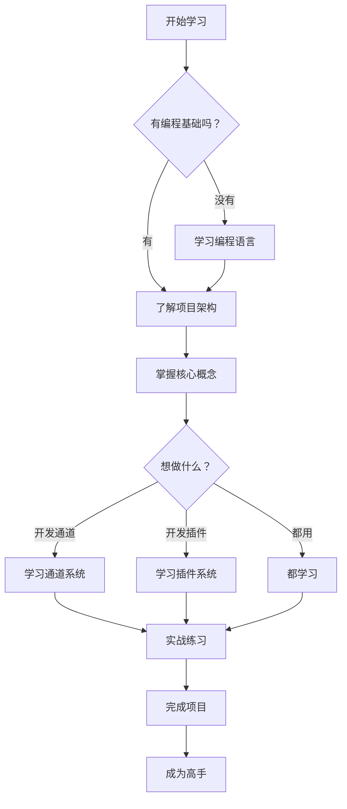

# OpenClaw 项目分析 - 快速导航

## 📂 文档结构

```
project-analysis/
├── README.md                    # 📚 项目学习指南（总览）
├── languages/
│   └── README.md                # 💻 编程语言知识
├── architecture/
│   └── README.md                # 🏗️ 项目架构分析
├── core-concepts/
│   └── README.md                # 📖 核心概念详解
├── channels/
│   └── README.md                # 📡 通道系统解析
├── plugins/
│   └── README.md                # 🧩 插件系统指南
└── learning-path/
    └── README.md                # 🎯 学习路径规划
```

## 🚀 快速开始

### 我是零基础小白
👉 从 [`learning-path/README.md`](./learning-path/README.md) 开始

### 我想先学编程语言
👉 查看 [`languages/README.md`](./languages/README.md)

### 我想了解项目架构
👉 阅读 [`architecture/README.md`](./architecture/README.md)

### 我想理解核心概念
👉 参考 [`core-concepts/README.md`](./core-concepts/README.md)

### 我想开发通道集成
👉 学习 [`channels/README.md`](./channels/README.md)

### 我想开发插件
👉 查看 [`plugins/README.md`](./plugins/README.md)

## 📋 各模块简介

### 1. [项目学习指南](./README.md)
- 项目概述
- 适合人群
- 使用指南
- 学习建议

### 2. [编程语言](./languages/README.md)
涵盖项目中使用的全部编程语言：
- **TypeScript/JavaScript** - 主要开发语言
- **Node.js** - 运行时环境
- **Shell Script** - 自动化脚本
- **Swift** - iOS/macOS 应用
- **Kotlin** - Android 应用
- **YAML/JSON** - 配置文件
- **Markdown** - 文档编写

每个语言都包含：
- 基础语法
- 核心概念
- 实际示例
- 学习资源

### 3. [项目架构](./architecture/README.md)
深入剖析 OpenClaw 的整体设计：
- 整体架构图
- 核心组件详解
- 目录结构说明
- 数据流示例
- 关键技术点
- 设计模式
- 性能优化

### 4. [核心概念](./core-concepts/README.md)
掌握必要的理论知识：
- Gateway（网关）
- Channel（通道）
- Session（会话）
- Agent（智能体）
- Tool（工具）
- Plugin（插件）
- Node（节点）
- Provider（模型提供商）
- 安全、通信、AI 相关概念

### 5. [通道系统](./channels/README.md)
学习如何集成通信平台：
- 支持的通道列表
- 通道架构
- 配置方法
- 实现示例
- 消息流转过程
- 开发新通道
- 调试技巧
- 常见问题

### 6. [插件系统](./plugins/README.md)
掌握扩展开发技能：
- 插件类型
- 插件结构
- 开发流程
- SDK API
- 测试方法
- 最佳实践
- 调试技巧
- 进阶主题

### 7. [学习路径](./learning-path/README.md)
由浅入深的学习计划：
- **第 1 阶段**: 基础准备（2-4 周）
- **第 2 阶段**: 理解架构（2-3 周）
- **第 3 阶段**: 核心模块（4-6 周）
- **第 4 阶段**: 实战练习（持续）
- **第 5 阶段**: 高级主题（可选）

包含：
- 每周学习目标
- 实践项目
- 检查清单
- 学习建议

## 🎯 推荐学习顺序

### 方案 A：循序渐进（推荐）

```
1. 阅读总览文档
   ↓
2. 学习编程语言基础
   ↓
3. 理解项目架构
   ↓
4. 掌握核心概念
   ↓
5. 深入学习通道/插件
   ↓
6. 跟着学习路径实践
```

### 方案 B：目标导向

```
1. 确定目标（如：开发一个 Telegram Bot）
   ↓
2. 查找所需知识
   ↓
3. 针对性学习
   ↓
4. 实践项目
   ↓
5. 补充理论知识
```

### 方案 C：问题驱动

```
1. 遇到问题
   ↓
2. 定位相关模块
   ↓
3. 阅读对应文档
   ↓
4. 解决问题
   ↓
5. 系统学习相关知识
```

## 📊 知识点地图

```
OpenClaw 知识体系
│
├─ 基础层
│  ├─ TypeScript 语法
│  ├─ Node.js 运行时
│  └─ 开发工具链
│
├─ 架构层
│  ├─ WebSocket 网关
│  ├─ 插件化架构
│  └─ 模块化设计
│
├─ 核心层
│  ├─ 通道系统
│  ├─ Agent 系统
│  ├─ 会话管理
│  └─ 工具调用
│
├─ 扩展层
│  ├─ 插件开发
│  ├─ 通道集成
│  └─ 自定义工具
│
└─ 应用层
   ├─ 配置部署
   ├─ 调试优化
   └─ 实战项目
```

## 🔍 快速查找

### 想找某个概念的解释？
→ 查阅 [`core-concepts/README.md`](./core-concepts/README.md)

### 想了解整体架构？
→ 阅读 [`architecture/README.md`](./architecture/README.md)

### 想学习某种语言？
→ 参考 [`languages/README.md`](./languages/README.md)

### 想开发新功能？
→ 查看 [`plugins/README.md`](./plugins/README.md) 或 [`channels/README.md`](./channels/README.md)

### 想系统学习？
→ 跟随 [`learning-path/README.md`](./learning-path/README.md)

## 💡 使用技巧

### 1. 善用搜索
在文档中使用 `Ctrl+F` (Windows) 或 `Cmd+F` (Mac) 快速查找关键词。

### 2. 做笔记
准备一个笔记本，记录重点和疑问。

### 3. 多实践
不要只看文档，要动手写代码。

### 4. 提问题
遇到问题先思考，再查文档，最后问社区。

### 5. 常复习
定期回顾已学内容，加深理解。

## 🌟 学习路线图



## 📞 获取帮助

### 官方渠道
- [Discord 社区](https://discord.gg/clawd)
- [GitHub Issues](https://github.com/openclaw/openclaw/issues)
- [官方文档](https://docs.openclaw.ai)

### 学习资源
- 本文档系列
- 官方示例代码
- 社区项目

## 🎓 学习成果检验

### 初级水平
- ✅ 能运行项目
- ✅ 理解基本概念
- ✅ 会简单配置

### 中级水平
- ✅ 能开发插件
- ✅ 会调试问题
- ✅ 理解架构设计

### 高级水平
- ✅ 能设计复杂功能
- ✅ 会性能优化
- ✅ 能贡献代码

## 📝 更新日志

- **2026-04-02**: 创建完整的文档体系
  - 新增项目概述
  - 新增语言学习指南
  - 新增架构分析
  - 新增核心概念详解
  - 新增通道系统解析
  - 新增插件系统指南
  - 新增学习路径规划

---

## 🎉 开始你的学习之旅吧！

记住：**每个专家都曾经是初学者**。不要害怕困难，坚持下去，你一定能成功！

**祝你学习愉快！🦞**

*最后更新：2026 年 4 月 2 日*
